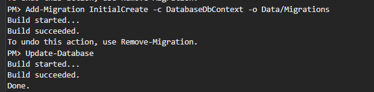

# TimelineManager

## Install

Install Environment Development:

* [.NET Core SDK (3.1 or later)](https://dotnet.microsoft.com/download)
* [Node.js (10.13 or later)](https://nodejs.org/en/)

## Build & RUN

* Using [Visual studio Code](https://code.visualstudio.com/) for code frontend
* Open [Visual Studio 2019](https://visualstudio.microsoft.com/vs/) => set as Startup Project => then "F5"
* Or using with following commands:

```
cd src/TimeLineManager
dotnet build
dotnet run
```

* If file db/timelinemanager.db not found, please run again command: `dotnet ef database update`. You should use Visual studio 2019 for `Add-Migration` & `Update-Database`
## Connection string
```
  "ConnectionStrings": {
    "DatabaseDbContext": "Data Source=db/timelinemanger.db"
  },
```

## Add Migration/Init Database

```
Add-Migration InitialCreate -c DatabaseDbContext -o Data/Migrations
Update-Database
```


## Frontend Angular: Create Component

* using the following commands:

```
ng g c post/timeline-link-popup --style=scss --skip-import --skip-tests

```

## NEW ISSUES:

Please contact to me:

* Nguyen Van Nam
* Phone: [0349801673](tel:0349801673)
* Email: [nguyenvannam0411@gmail.com](mailto:nguyenvannam0411@gmail.com)

## ISSUES for entityframework:
* https://github.com/dotnet/EntityFramework.Docs/issues/1371

# Donate
If you find this project useful — or just feeling generous, consider buying me a beer or a coffee. Cheers! :beers: :coffee:
|               |               |
| ------------- |:-------------:|
|   <a href="https://www.paypal.me/ngnam39"></a>   | [](https://www.buymeacoffee.com/ngnam) |
